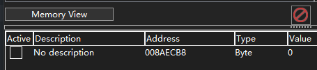

# Jaga Almighty's Grand Adventure (misc)

Jaga was returning from a nearby convenience store when it was suddenly summoned to a fantasy-like world of supernatural abilities and magic. Not long after arriving, Jaga discovered that it could fly! And it must fly to the boss castle to save the princess, as is typical of adventure games. However, the road ahead is paved with danger and pipes, and each time it hits a pipe, it is magically teleported to where he first spawned in the world! Could you help Jaga Almighty to navigate past at least 69 pipes?

# Exploring the binary
1. It is a flappy-bird game and we need to score 69 and above to get the flag.
2. The binary is a Windows executable and it is very hard to fully disassemble and reverse it due to the language it is being written in and the game assets embedded.

# Solution
1. We can use a debugger to do dynamic analysis. Cheat Engine is a very powerful yet simple to use tool for this purpose.
2. Start the game, and open the process in Cheat Engine:


3. The idea is to scan for the memory address that stores the score. Most programs (including this one) will store them in the memory segment used by the program executable itself, and not any other DLLs, since this game does not come with any other DLL. To filter out the noise and make scanning faster, we can thus limit the memory scan to the executable itself, by selecting it under memort scan options:


4. We can start a game and before we score anything or die, we scan for the current score. Usually we start with the 'byte' type since it is the most commonly used, but if you are not sure, you can always scan for all data types. Select 'Byte' for Scan Type, and enter 0 for value. 0 is our current score since we have not passed any pipes. A neat feature of this game is if you switch your focus to another window, the game pauses itself, so you can take your time to scan. You can also enable SpeedHack in Cheat Engine and slow it down if you cannot switch windows fast enough. Click First Scan. Cheat Engine will return a list of memory addresses that currently holds the value '0'.


5. Don't be scared by the sheer amount of addresses found - you will need to repeat step 4 as your score changes, since if a memory address is not used for storing the score, it is almost certain that it will change to some other value different from your current score at some point.

For example, now I have score of 1, I will scan for value 1 and press Next Scan (not New Scan!). Cheat Engine will filter the current list of memory addresses to only contain those that currently holds the value '1'.  Depending on luck, you may need to repeat step 4 for a couple of times, until you are left with addresses that you observe reliably changes with your current score. For this binary, the score is not being reset to 0 after you die, but to be safe, I did all the scanning while alive (and paused).


Note how the first address in the list has value of 0 and highlighted in red, this is because when I pressed the scan button, the value is 1, but immediately after (before I managed to screenshot), the value changed to 0. Cheat Engine will highlight values changed since last scan red. If the value at this memory address is changing even without us playing the game (remember the game is paused if we switch focus to the Cheat Engine window), then it surely cannot be holding the score. If you observe this, you can click on Next Scan again to filter out those changed values without returning to the game. This speeds up the process a lot.

6. After 3 scans, we are only left with 1 address:


This will be the address we are looking for. Note that if you restart the executable, it will change, but you can always just redo the scanning.

7. We now add this address to the addresslist below so we can do something about it. Right click on the address and select 'Add selected addresses to addresslist'. You should see a 'No Description' entry.


### Note: steps 8,9 is a failed attempt. I write it here to show you how some games are hardened against a simple hack like this (and surprisingly, some big games like GTA V are NOT hardened against this). If you only want to know the working solution, skip to step 10.
8. First thing we can try is to force set the value of this address. Right click on the address (in the addresslist below, not in the top left window), choose set hotkeys. Then add a hotkey of your choice (I used space because it triggers every time I do a jump), then choose the action to set the value to 69.


9. We can do a test, if we press space bar, you should see the value being set to 69. However, this does not mean we are getting the flag, because we have to make sure it stays at 69 and above when we play the game (and passes a pipe). Sadly, it does not. It seems like the game does some hardening against this, by resetting the score to the real one constantly, so you will see the score being changed to 69 then back to your real score. We need another way out.

### Working solution
10. Since we know that somewhere somehow, the game is checking for a score >= 69 so that it can give the flag. Of course we can search for this check statically in a dissembler like IDA, but with Cheat Engine, it can be much easier. All we need to do is to check what is reading from this memory address that holds the score, since to do a comparison, you have to read the current score first. In Cheat Engine, right click on the address, then choose 'find out what accesses this address':


You will be prompted to attach debugger to the process. Click yes. You will see a pop up with nothing inside. This is because the game is being paused so no code is actually running now, therefore no code is accessing this memory address, We need to go back to the game and play for a second.

11. You should now see 2 places:


Let's click on both and copy the disassembly and register info:
```
super_jaga_adventure.exe+21C8E0:
0056C8D6 - 66 0F1F 84 00 00000000  - nop word ptr [rax+rax+00000000]
0056C8DF - 90 - nop 
0056C8E0 - 48 39 35 D1233400  - cmp [super_jaga_adventure.exe+55ECB8],rsi <<
0056C8E7 - 0F8D A2050000 - jnl super_jaga_adventure.exe+21CE8F
0056C8ED - 48 83 FE 45 - cmp rsi,45

RAX=0000000000000000
RBX=0000000000000000
RCX=000000C000028180
RDX=000000000000000C
RSI=0000000000000000
RDI=0000000000000126
RSP=000000C0008039A0
RBP=000000C000803B68
RIP=000000000056C8E7
R8=0000000000000144
R9=00000000000001C4
R10=0000000000000000
R11=0000000000000008
R12=000000C000803A20
R13=0000000000000002
R14=000000C0000556C0
R15=0000022BB8F7FFFF


First seen:11:52:28
Last seen:11:52:29
```
```
super_jaga_adventure.exe+21CE8F:
0056CE87 - 48 81 C4 D0010000 - add rsp,000001D0
0056CE8E - C3 - ret 
0056CE8F - 48 89 35 221E3400  - mov [super_jaga_adventure.exe+55ECB8],rsi <<
0056CE96 - 31 C0  - xor eax,eax
0056CE98 - 31 DB  - xor ebx,ebx

RAX=0000000000000000
RBX=0000000000000000
RCX=000000C000028180
RDX=000000000000000C
RSI=0000000000000000
RDI=0000000000000126
RSP=000000C0008039A0
RBP=000000C000803B68
RIP=000000000056CE96
R8=0000000000000144
R9=00000000000001C4
R10=0000000000000000
R11=0000000000000008
R12=000000C000803A20
R13=0000000000000002
R14=000000C0000556C0
R15=0000022BB8F7FFFF


First seen:11:52:28
Last seen:11:52:29
```

12. If we examine the first one, we can already see something fishy. The line that reads the score is `cmp [super_jaga_adventure.exe+55ECB8],rsi` (`super_jaga_adventure.exe+55ECB8` is the memory address of the score, expressed in base address of `super_jaga_adventure.exe` + offset of `55ECB8`). It seems to compare the score with whatever is at rsi. RSI right now is 0. This is likely the line that checks if the score in memory has been modified like we tried in steps 8-9, and if it is, it jumps to `super_jaga_adventure.exe+21CE8F` (which is likely the second segment found that is accessing the score), copies over the legit score to this memory address in `mov [super_jaga_adventure.exe+55ECB8],rsi`. This means the 'real' score is stored in the RSI register. Immediately after, we see a `cmp rsi,45`. Note this `45` is in hex, which is exactly `69` in decimal. It is comparing the 'real' score with 69. We can then try to change this `cmp rsi,45` to something like `cmp rsi,1`. If our guess is correct, we should be able to get the flag by scoring just 1.

13. To do this, click on 'Show dissembler', and you will see a Memory Viewer window:


14. Move the cursor to that line `cmp rsi,45`, double click on that line, and change the instruction to `cmp rsi,1`:


15. Then we can just play the game and get 1. You will see a small text at top left that says flag has been saved. We then now go to the folder that holds the executable (or the working directory, if it is not the same as the location of the executable), and open nice_flag.bin with text editor.

Flag: `STF22{iF_n0_s@vep0int_s@d_lIfE} `