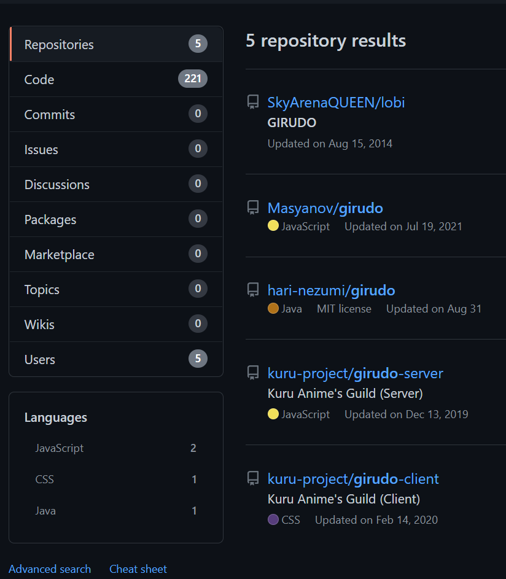
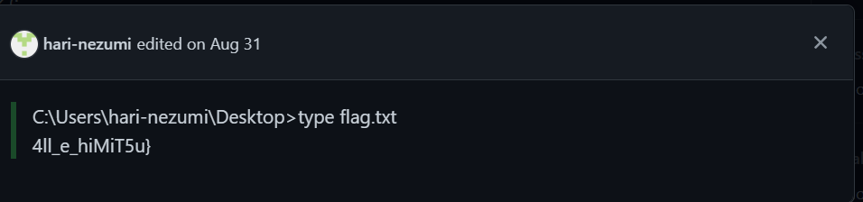

# New Tasks! (OSINT)

Jaga got summoned to the new world and was given some new tasks to investigate why the employees of kono-girudo.com kept receiving phishing emails. It also seems like there is information disclosure for those working on Girudo project but could not find out where the disclosure was.
Jaga needs your help to determine why they kept receiving phishing emails and what sensitive information was exposed for the project.

## Part 1: Investigate the phishing emails

WHOIS lookup for kono-girudo.com revealed nothing worthy, it seems to just be a temporary domain registered with namecheap and has the registrant's contact info all hidden. Viewing source for the website also revealed nothing. Since the challenge description mentioned phishing emails, I decided to go down the route of email server and domain.

Google searching "phishing email domain check" and scrolling down a bit will yield this [tool](https://dmarcian.com/domain-checker/) that claims to check "if an email domain is protected against phishing, spoofing or fraud". This tool checks the DMARC of the email domain.

From [here](https://www.dmarcanalyzer.com/dmarc/), DMARC (Domain-based Message Authentication Reporting and Conformance) is an email validation system designed to protect your company’s email domain from being used for email spoofing, phishing scams and other cybercrimes. DMARC leverages the existing email authentication techniques SPF (Sender Policy Framework) DKIM (Domain Keys Identified Mail). DMARC adds an important function, reporting. When a domain owner publishes a DMARC record into their DNS record, they will gain insight in who is sending email on behalf of their domain. This information can be used to get detailed information about the email channel. With this information a domain owner can get control over the email sent on his behalf. You can use DMARC to protect your domains against abuse in phishing or spoofing attacks.

Under the DMARC records for kono-girudo.com, we can see the first half of the flag: `v=DMARC1; p=none; STF22{le4k3d_`.

## Part 2: Investigate the information disclosure

Googling for "Girudo project" yields nothing interesting due to a similarly named anime.

From the description, the word 'project' hinted me to look for Github repositories, because people usually call them projects, and also because this is a CTF so it got a higher chance to be programming-related. Lastly, there are too many past OSINT challenges in ctfs where they leaked the flag in commit history.

Indeed, searching for 'Girudo' for repositories only have 5 results, and there is only 1 that is updated in 2022. It is very unlikely that such a OSINT challenge will the set in 2021 or earlier, thus we can check out the 2022 one first.

The repository is [here](https://github.com/hari-nezumi/girudo).

We can see in the README that it is about a Burp Suite plugin named `autowasp`. This is in fact a project by GovTech CSG (the organizer of this CTF), so this confirms that we came to the right place.

We first check the commit history. The commit messages are clearly jokes, but there is nothing interesting in the commit messages alone. We noticed some merged pull requests, so started checking from the most recently merged one: [PR #4](https://github.com/hari-nezumi/girudo/pull/4).

The comments are just filled with Lorem ipsum, but the last comment has been edited. Checking the edit history, we can find the second part of the flag:

Flag: `STF22{le4k3d_4ll_e_hiMiT5u}`