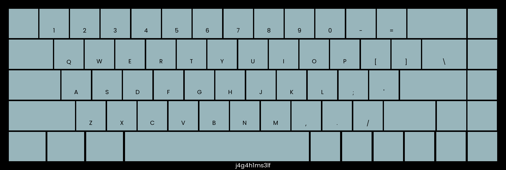
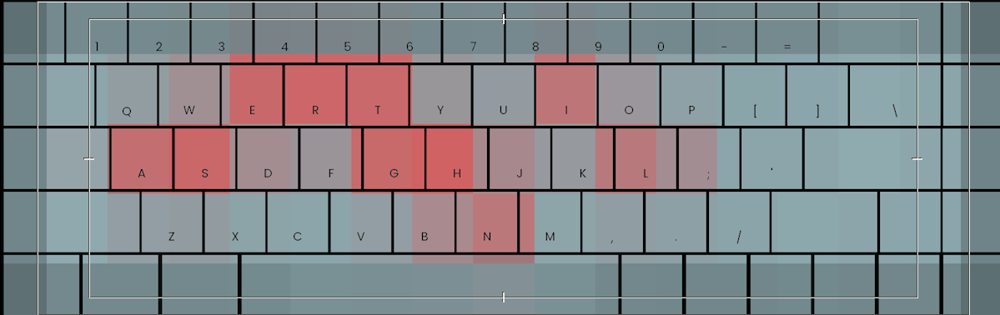

# Heatkeeb (misc)

Jaga had gained interest in custom keyboards and has created a platform to create your own keebs! We know we created his custom keeb on the 22nd of September 2022, at 09:41:17 SGT. Oddly specific but we know it's true.

## Analysis
We are given a Python webapp that allows for creating custom keyboards and generating heatmaps for it. We are able to check other's keyboard via a token, create our own (and receive our own token), and a /menu page where we can rebuild keyboard, view keyboard, generate heatmap, view latest heatmap and test your text (check if the word you entered is same as the word last used to generate the heatmap).

The conditions for obtaining the flag would be:
1. Correct admin token
2. Correctly guess the admin's last entered word to generate heatmap
```python
@app.post('/text')
def flag(request: Request, text: str = Form(...)):
    if 'token' in request.session:
        with shelve.open('keebdb') as db:
            token = request.session['token']
            if token in db:
                if token == ADMIN_TOKEN and text.upper() == KEY:
                    return templates.TemplateResponse("flag.html", {"request": request, "word": text, "flag": FLAG})
                elif text.upper() == db[token]['text']:
                    return templates.TemplateResponse("flag.html", {"request": request, "word": text})
    return templates.TemplateResponse("flag.html", {"request": request})
```

## Solution
### Obtaining the admin token
We first need to find where this token is being generated. It can be found that token is being generated at time of building the keyboard, which is given in description to be exactly 22nd of September 2022, at 09:41:17 SGT. The token is a random choice of letters but the random seed is being set to the timestamp.
```python
@app.post("/build")
def build(request: Request, name: str = Form(...), frameColor: str = Form(...), keyColor: str = Form(...), textColor: str = Form(...), specialColor: str = Form(...)):
    t = datetime.datetime.now(pytz.timezone('Asia/Singapore'))
    seed = int(t.timestamp())
    random.seed(seed)
    token = ''.join(random.choices('abcdefghijklmnopqrstuvwxyzABCDEFGHIJKLMNOPQRSTUVWXYZ0123456789', k=16))
    with shelve.open('keebdb') as db:
        db[token] = {
            'name': name,
            'frameColor': hex_to_rgb(frameColor),
            'keyColor': hex_to_rgb(keyColor),
            'textColor': hex_to_rgb(textColor),
            'specialColor': hex_to_rgb(specialColor),
            'text': 'default'
        }
    img = draw_keeb(name, hex_to_rgb(frameColor), hex_to_rgb(keyColor), hex_to_rgb(textColor), hex_to_rgb(specialColor))
    img.save(f'keebs/keeb-{token}.png')
    request.session['token'] = token
    return templates.TemplateResponse("build.html", {"request": request, "resp": "Success!", "token": token})
```
To replicate the same random results, we can just manually set the seed to that time using the following code:
```python
import random
import datetime
import pytz
t = datetime.datetime(2022, 9, 22, 1, 41, 17)
seed = int(t.timestamp())
random.seed(seed)
token = ''.join(random.choices('abcdefghijklmnopqrstuvwxyzABCDEFGHIJKLMNOPQRSTUVWXYZ0123456789', k=16))
print(token)
```
We will get `rMwwbpMkzAwyRoWs` as the admin token. To view its heatmap, we just enter using this token on the home page. We can verify we are indeed logged in as admin by viewing the keyboard first and checking the name:



Indeed `j4g4h1ms3lf`!

### Obtaining the admin's last entered word
Admin's latest heatmap looks like this:


If we overlay it on the keyboard (I used Adobe Premiere Pro here), we can see that the letters are `ERTIASGHLN:



If we use an online unscrambler like [this one](https://wordunscrambler.me/unscramble/ertiasghln), we can get the word `earthlings`. Entering that, we will have the flag: `STF22{h34t_k3yb04rD}`