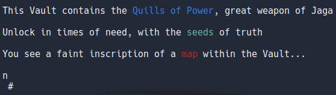
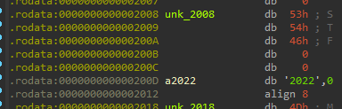
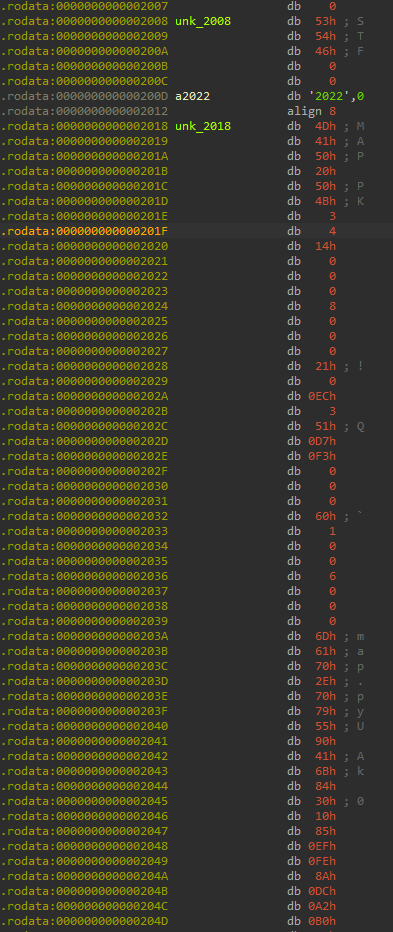
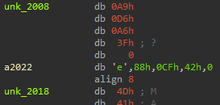

# Quills of Power (RE)

The Quills of Power is a magical artifact passed down for generations in the Jaga family to be retrieved in times of great need in the face of great security vulnerabilities. Help Jaga retrieve the Quills of Power from the Vault.

## Analysis

The challenge binary is a 64-bit ELF. Running it will print give:



Looks like some unreadable bytes. Maybe we need to turn them into the flag.

Decompiling in IDA, we can see the main function:
```c
__int64 __fastcall main(int a1, char **a2, char **a3)
{
  printf(format, a2, a3);
  printf(off_40C8);
  printf(off_40D0);
  sub_1159(off_40A8);
  sub_1159(off_40B0);
  printf("%-80s", aU);
  return 0LL;
```

We can ignore the first 2 `printf` since they are just the welcome message. Our goal should be to make it print the flag in the last `printf`. `aU` is a pointer to some bytes in the data sector. This is likely the flag, although encrypted in some way. We need to see what does `sub_1159` do to decrypt.

```c
void __fastcall sub_1159(unsigned int *a1)
{
  int i; // [rsp+2Ch] [rbp-4h]
  
  srand(*a1);
  for ( i = 0; i <= 19; ++i )
    *(_DWORD *)&aU[4 * i] ^= rand();
}
```

It takes in only 1 argument and pass it to the stdlib `srand()` function. This is a function to set random seeds, so that subsequent `rand()` calls are reproducible every run.

It then loops through 19 times, taking 4 bytes from `aU` and XOR it with a random number generated by `rand()`. This is likely the encryption method.

Notice how `sub_1159` is being called twice with different arguments (random seeds). We can try to see what is the seed like. This is being hinted by the welcome message too.



`unk_2008` is the first seed, and `a2022` is the second. First one seems to be "STF" with 2 zero bytes, and second one is just ascii text "2022". Of course, this would not be the seed we need to find, because these seeds give non-readable bytes.

Interesting, if we just scroll down a little bit, right below `a2022` in the data section, we can see some bytes that looks like the header of a zip file:



And it has the word "MAP" in it. Recall the welcome message also hinted about "map". This is likely a zip file embedded into the binary. We can extract it using `binwalk -e qop`. Unzipping it, we can find `map.py`:

```python
import bs4
import requests


def map():
    url = 'https://www.tech.gov.sg/contact-us/'
    response = requests.get(url)
    soup = bs4.BeautifulSoup(response.content, 'html.parser')
    tag = soup.find(string='FIND DIRECTIONS').parent.parent.parent
    seeds = tag.attrs['href'].split('/')[6][1:].split(',')[:2]


if __name__ == '__main__':
    map()
```

Now, it is clear that the correct seed should be the output of this Python script. Running it (and printing the seeds), we will have: `['1.3034259', '103.7663942']`

## Patching

We now have to convert these two seeds to bytes, then patch them into the binary, so that it uses the right random seeds and print the flag. We can find the hex representation using a simple Python script:

```python
import struct
value = ['1.3034259', '103.7663942']
for v in value:
    ba = bytearray(struct.pack("f", float(v)))
    print(["0x%02x" % b for b in ba ])
```

We will get `['0xa9', '0xd6', '0xa6', '0x3f']` and `['0x65', '0x88', '0xcf', '0x42']`. Patching these into IDA:



Then we run the binary again, we will get the flag: `STF22{Hom3.i5.Wh3r3.th3.Pow3r.li3s}`

Note that the order of the seeds does not matter because of XOR being commutative.